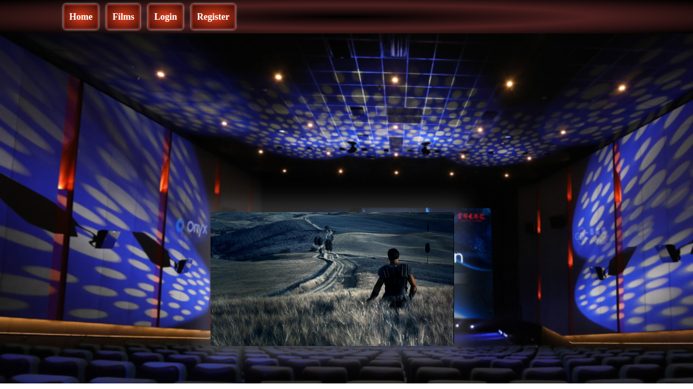

---

<pre>

Axios              

                        

                              

</pre>

---

> 
 <h1> Online Store ( Frontend project ) </h1>

 

> As the fifth project was required by th GeeksHubs staff, we were assigned to work on this project as a team, to cover all aspects (from backend to fronted) of this online store.

### The team consisted of the following members (in alphabetical order);
>https://github.com/Alexdck (Mac)
https://github.com/Claudia1010 (Windows)
https://github.com/obordonado (Linux)

> <b>The backend</b> of a previous project (https://github.com/obordonado/Blueclub) was taken as example and modified to suit the requirements, adjusting its code, and the previous DDBB.

>We've used MySql-WorkBench to connect to the DDBB in order to see in real time any modifications made.

> The DDBB has been deployed at https://heroku-sqlurl.herokuapp.com/ to imitate a 24h online store.

> The Front-End (https://github.com/Alexdck/teamProyectReact) 

> To make this project, we've worked remotely (from home) to better understand its difficulties and overcome them as a proffessional team working 100% in full remote.
> All the icons at the header allude to the technologies we've used in for this project.

#### The requirements for this project included;

>- React and Redux as the base.
>- Connections to endpoints to be made through Axios.
>- Must be a Single Page Application.
>- Must be responsive.
>- Passwords must be secured (We hashed them with Bcrypt)

 
<pre>
C.R.U.D.
    - Main view of the online store.
    - View of the available movies to buy.
    - Description and movie trailer.
    - Users can :
        - Register.
        - Log in.
        - Log out.
</pre>

---
## 
Screenshots

---

#### Home Page

> In the Home page we decided to put a carousel so the user may see some of the options he can purchase as well as to make it more dynamic.
> At the top we included a NavBar, for the user to click on and the user can:
>- View all possible movies.
>- Register.
>- Log in.

 

 

---
> #### Film link.

> In the Home page we decided to put a carousel so the user may see some of the options he can purchase as well as to make it more dynamic.
> At the top we included a NavBar, for the user to click on.

 

● Register page:

 

 

● Films page:

 

 

##Technologies:

 

<code></code>
<code></code> <code></code> <code></code> <code></code> <code></code> <code></code> <code></code>

 

##Deploy:

 

