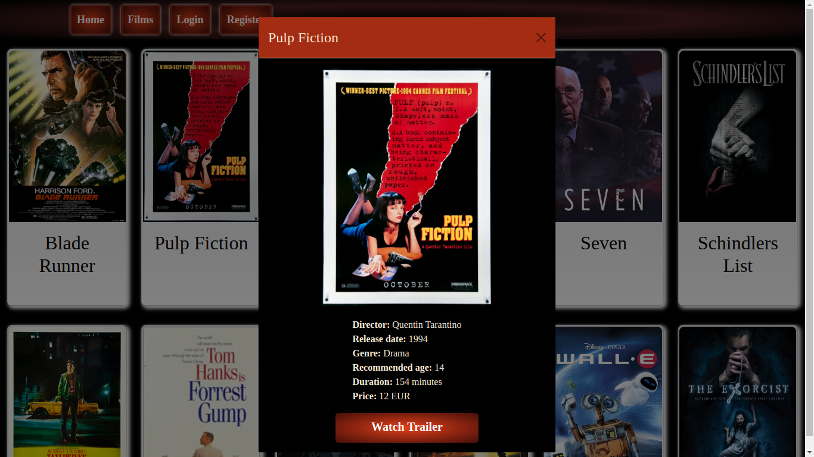
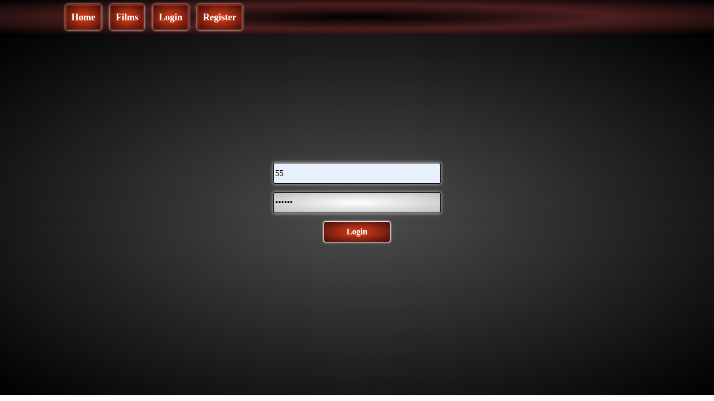
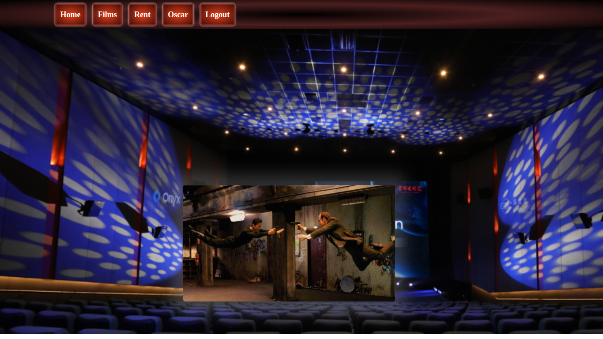
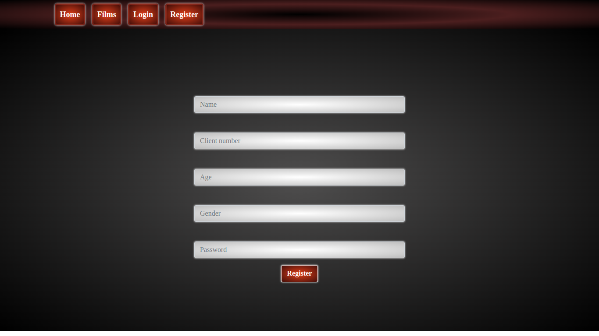
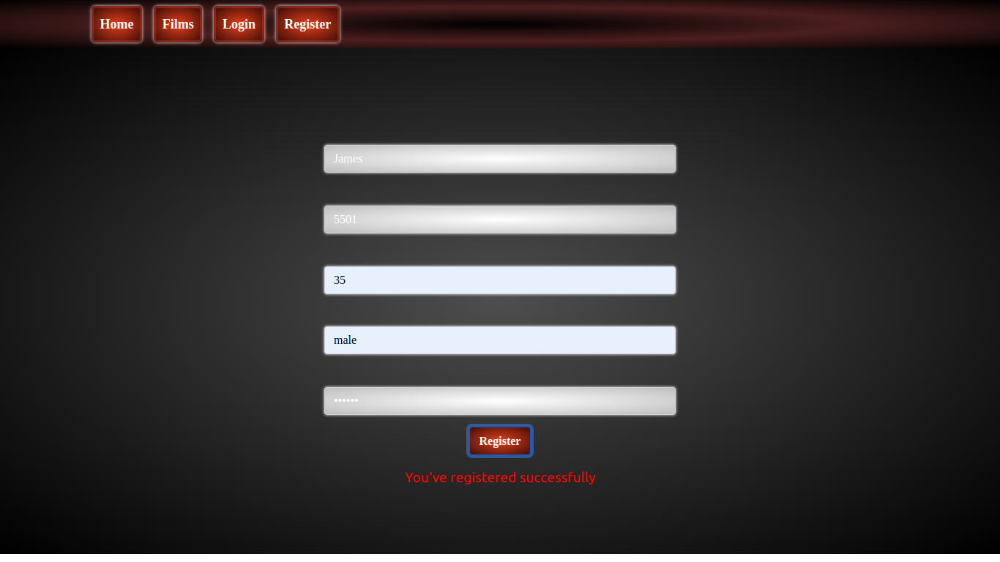
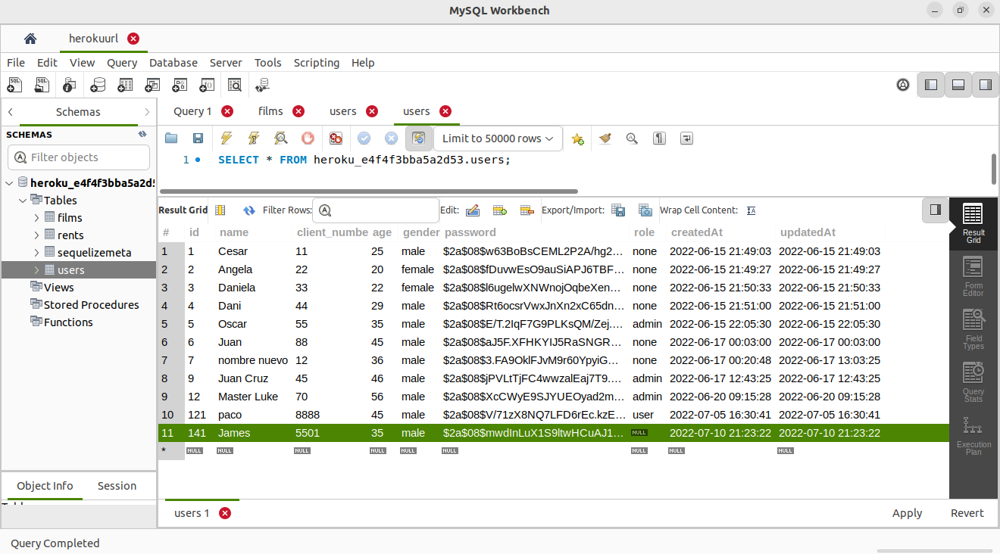
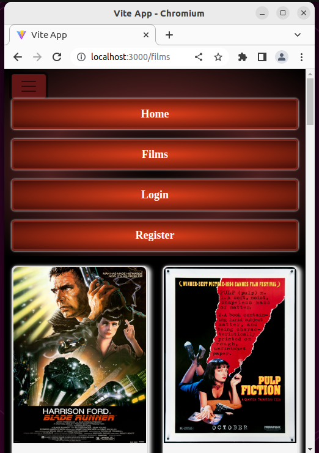

---

<pre>

Axios              

                        

                              

</pre>

---

> 
 <h1> Online Store ( Frontend project ) </h1>

 

> As the fifth project was required by th GeeksHubs staff, we were assigned to work on this project as a team, to cover all aspects (from backend to fronted) of this online store.

### The team consisted of the following members (in alphabetical order);
>https://github.com/Alexdck (Mac) 
https://github.com/Claudia1010 (Windows) 
https://github.com/obordonado (Linux) 

> <b>The backend</b> of a previous project (https://github.com/obordonado/Blueclub) was used and modified to suit the requirements by adjusting its code, as same as the previous DDBB.

>We've used MySql-WorkBench to connect to the DDBB hosted in Heroku in order to see in real time any modifications made.

> The DDBB has been deployed at https://heroku-sqlurl.herokuapp.com/ to imitate a 24h online store.

> The Front-End hosted in Github (https://github.com/Alexdck/teamProyectReact) was used for all three members to work with. 

> To make this project, we've worked remotely (from home) to better understand its difficulties and overcome them as a proffessional team working 100% in full remote.
> All the icons at the header allude to the technologies we've used in this project.

#### The requirements for this project included;

>- React and Redux as the base.
>- Connections to endpoints to be made through Axios.
>- Must be a Single Page Application.
>- Must be responsive.
>- Passwords must be secured (We hashed them with Bcrypt)
>- Must have an admin user.

 
<pre>
C.R.U.D. with:
    - Main view of the online store.
    - View of the available movies to purchase.
    - Description and movie trailer of the selected movie.
    - Users can :
        - Register.
        - Log in.
        - Log out.
</pre>

---
## 
Screenshots

---

#### Home Page

> In the Home page we decided to put a carousel so the user may see some of the options he can purchase as well as to make it more dynamic. 
> At the top we included a NavBar, for the user to click on and the user can:
>- View all possible movies.
>- Register.
>- Log in.

 

---
> #### Film link.

> In the "Film" page we decided to use cards (Bootstrap) with the available information of all the movies.
> The user can click on any of them, and a pop-up window will show information relative to the movie that has been selected.
> In the new window, the user will be able to see a trailer of the selected movie.

---
> #### Log in link.

> In the "Login" page, the user will be required to type his / her client number and password in order to work.
> If the user doesn't exist or data is incorrect, an "incorrect user / password" message will be shown.

---
> If the "log in" is correct, he / she will be re-directed to the home page and, a button with his / her name will be visible in the Header.
> A new button will also appear so that the user can log out.

---
> #### Register link.

> In the "Register" page, the user will be prompted to introduce the required data in order to register correctly.
> All data must be filled in for the user to be able to register.

----
> Once the user has clicked the register button at the end of the form, he / she will see a message indicating that he / she registered correctly.

---
> In order to verify that a new user has been created and the password has been secured (hashed), we can see it by using MySql-Workbench:

---
> #### Responsive.

> Due to the use of Mobile first, every possible view is responsive, so that any user can use the store from any device.

---

> The project was made with the participation of all three coders in every level so that the learning process would be greater.
> Enjoy the code and know that any suggestion will be gladly received!

